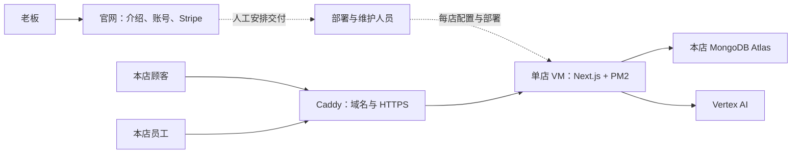
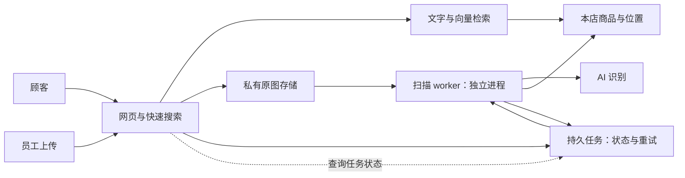

# WhatAisle 十家店资源与架构建议

> 2026-09-04 · 讨论方案，尚未实施。功能范围见 [MVP 对照表](./MVP-REVIEW.zh.md)。

**推荐前十家店继续独立部署，维护一份共同代码，先改善扫描、搜索和发布之间的隔离。** 这样可以逐店升级和搬家，也最贴近已经跑起来的系统。

## 你想解决的，其实是四件事

| 你关心的结果 | 系统需要具备什么 | 例子 |
| --- | --- | --- |
| 改一个功能，不容易弄坏其他功能 | 模块边界与稳定的数据接口 | 改拍照识别，只影响“识别结果怎么产生”，不要求重写商品卡片 |
| 一个功能忙，不拖慢其他功能 | 独立运行任务、资源配额、请求优先级 | 员工批量拍货架，顾客仍能及时找货 |
| 更新一个部分，不让所有店一起停 | 分别发布、逐店验证、旧版可继续工作 | 先更新演示店，再更新一家营业店，异常时只退回那家 |
| 换服务器/数据库/AI 供应商比较容易 | 店铺配置外置、数据可导出、供应商入口集中 | 顾客继续扫原来的二维码，后台换机器即可 |

**只把代码拆成几个文件夹，只解决第一件的一部分。** 要做到独立发布，通常需要单独运行的服务；即便服务拆开，仍共用的数据库、AI 配额和云账单也可能成为共同故障点。

## 当前实际架构

同样的门店单元按店复制。官网与门店是两个项目，**官网的 Cloud Run/Postgres 不能当作门店的 VM/MongoDB 来估算**。

| 证据层级 | 本轮确认内容 |
| --- | --- |
| 源码与脚本 | `whataisle-store` 一次部署一家店；店名、货架、地图来自 `store.config.ts`；Caddy + PM2 + Next.js；MongoDB Atlas；Vertex AI |
| 已访问的云资源 | 有一台运行中的 `wherebear-vm`：Toronto 区域、e2-medium、4 GiB、20 GB pd-balanced、自动重启开启 |
| 未核实 | VM 内正在运行哪个代码版本、各店实际数据库配置、真实流量/账单、备份恢复效果；未 SSH 或读取顾客数据 |
| 官网 | 部署文件设 Cloud Run 2 CPU / 4 GiB、并发 2、0–20 实例；当前无权限读其线上服务配置，不能称已确认运行规格 |

依据：[门店部署手册][D1]、[官网部署流程][D2]、[MongoDB 连接][D3]。旧 AGENTS 里的共享多租户架构、DashScope、ADK/MCP 不是本次门店源码的运行路径。

## 十家店怎样安排资源

### 推荐起点：十个独立门店单元，统一维护

| 部分 | 起点建议 | 边界和扩容信号 |
| --- | --- | --- |
| 每店应用 | 先沿用一台 e2-medium / 4 GiB / 20 GB，作为压测基线 | 高清图处理若引发内存不足、持续 CPU 满载或搜索变慢，优先限制扫描，再评估 8 GiB 级机器或迁出扫描 |
| 每店数据库 | 独立数据库、独立最小权限凭据；现有 Atlas 可以沿用 | 按实际容量、索引、延迟和读写量决定升级；不把“免费”当付费交付的可靠性保证 |
| 每店图片 | 当前只存商品小图；需要服务器可靠队列时，新增私有 GCS 图片存储 | 私有原图用于重试/重新识别，裁图供搜索展示；保留多久与客户承诺一起确定 |
| AI | 沿用每店独立 GCP 项目的调用和费用归属 | 给顾客搜索优先级，限制扫描同时运行数量；不同进程仍要共同控制同项目的调用量 |
| 官网/收款 | 继续独立部署 | 价格、宣传与收款页面更新不应要求重启门店 |
| 运营 | 一份集中门店台账 + 基础监控/费用告警 | 先看版本、健康、备份、费用，十家店阶段可以不用开发完整运营后台 |
| 验证环境 | 独立演示/验收环境和样例数据 | 不用客户数据库验证新代码或跑压力测试 |

e2-medium 有两个可见 vCPU，但持续计算配额合计约一个共享核，内存为 4 GiB。不能把它按两颗完整 CPU 估算。[Google 机器规格](https://docs.cloud.google.com/compute/docs/general-purpose-machines#e2-shared-core)

**四 GB 是待验证的起点，不是“每店一定够用”的承诺。** 现有照片处理就在网页服务器内运行；单张最大 20 MB，解码后的内存会明显大于文件大小。[图片入口][D4]

### 为什么现在不推荐合成一台大服务器

| 方案 | 好处 | 代价 | 本轮判断 |
| --- | --- | --- | --- |
| 每店独立 VM/数据库 | 故障范围小，逐店更新/搬迁直接，沿用现状 | 十份资源有固定费用，必须自动化部署和记录版本 | **前十店推荐** |
| 少量 VM，每店独立容器/数据库凭据 | 减少闲置资源，还能保留应用边界 | 同机故障影响数店，需要 CPU/内存限制、调度和迁移 | 获得真实用量后再比较 |
| 一套共享多租户应用/数据库 | 平台统一管理和扩容更集中 | 必须重做店铺身份、查询、缓存、文件、任务等隔离；现有单店代码不能直接合库 | 当前不建议为十店提前重建 |

独立 GCP **项目**不等于必须维护十个个人 Google **账号**。如果由平台托管，可在一个组织/账单体系下建店级项目和权限；若店家自己拥有云资源，则使用授权身份管理。先明确谁付云账单、谁拥有数据、停订后谁负责资源。

## 费用怎样算

预算统一用 **USD、每月 730 小时、无免费赠金额、无承诺折扣**计算。地区、流量、数据库级别尚未确认，所以以下是讨论用预算，不能当报价。

| 项目 | 讨论用预算/算法 | 包含什么、还缺什么 |
| --- | --- | --- |
| 十台基础门店机器 | 先预留 **$350–500/月** | 每店约 $35–50，预留 VM、基础磁盘、一个公网 IPv4；不是官方 Toronto 最终报价，也不含大量出站流量 |
| Atlas | 单独核算 | 若沿用 Free，集群服务费可为零；备份、数据迁移和升级另算；如必须用付费层，应整体重算预算 |
| 官网 | 单独核算，再按十店分摊 | Cloud Run、Cloud SQL、负载均衡、存储、邮件等现有费用，未读账单，不能假设为零 |
| 扫描 AI | 每月照片数 × 每张实际总花费 | 含所有阶段、重试和重复调用；首轮建档与平时补拍分开记 |
| 搜索 AI | 月搜索数 × 各输入方式平均花费 | 文字、语音、照片分开，含答案生成和可能的额外调用 |
| 其他 | 按用量加入 | 域名、备份存储、对象存储/出站、日志、监控；迁出扫描后的 worker 费用 |
| 服务成本 | 单独记录人工时间 | 安装、画图、培训、纠错、维护、客户支持，不属于服务器费 |

机器金额是根据官方 E2 按量价格量级预留的**估算范围**。最终应在目标地区逐项计算 `10 × (730 × VM 小时价 + 磁盘 + IPv4 + 出站)`；备份和付费数据库可能使总额明显上升。[Google 通用机器价格](https://cloud.google.com/products/compute/pricing/general-purpose)、[Google 网络价格](https://cloud.google.com/vpc/network-pricing)

一个纯粹用于理解敏感度的例子：十店每天各补拍 10 张，一个月是 3,000 张。**若实测**每张合计 $0.25，则仅补拍识别就是 $750/月。这里 $0.25 是示例输入，不是当前 Vertex 的已测单张价格。此前官网 OpenRouter 的旧实测也不能直接套用。

当前官网配置收入为每店 $199/月或 $1,990/年。十店全部月付是 $1,990/月；全部年付按十二个月平均约 $1,658/月。只是收入算术，不是利润：还要扣支付手续费、税费、全部云与 AI 费用和人工交付成本。依据：[价格配置][D5]。

部署手册依赖 $300/90 天赠金额，但 Google 免费试用针对符合条件的新用户，**不是新建项目就重新获得额度**。正式经营预算应排除赠金额；试用结束前安排正式计费，避免资源停止。[Google 试用规则](https://docs.cloud.google.com/free/docs/free-cloud-features)

### 数据库费用与容量的两个修正

Atlas Free 当前限制包括总计约 0.5 GB 的未压缩数据和索引、100 次操作/秒、滚动七天分别 10 GB 入站/出站；不提供内建云备份。因此要量真实数据与索引，并安排独立备份和恢复演练。**旧手册“约一万三千 SKU 足够”不是容量证明**，压缩后磁盘大小也不等于配额口径。[Atlas Free 限制](https://www.mongodb.com/docs/atlas/reference/free-shared-limitations/)

旧手册建议升级 M2 的路径已经过时，应重新比较 Free、Flex 或专用集群，以及它们是否支持当前用到的文字/向量搜索、自动嵌入和恢复要求。[Atlas 套餐迁移说明](https://www.mongodb.com/docs/atlas/flex-migration/)

### 费用提醒与费用上限

普通预算提醒本身不停止开销。Google 目前另有 **Spend cap budgets 预览功能**，支持指定单项目、单服务的部分 API 费用控制，包括 Vertex/Cloud Run；它不是即时、绝对的总账单硬上限，且不会停止 VM、存储等持续资源费用。触发会暂停对应新 API 使用，恢复需要人工处理。[预算提醒](https://docs.cloud.google.com/billing/docs/how-to/budgets)、[Spend cap 官方说明](https://docs.cloud.google.com/billing/docs/how-to/budgets-spend-caps)

建议先配置分店费用提醒、异常扫描提醒和人工处理流程；业务侧保留顾客搜索能力，优先约束扫描任务量。若要启用会暂停服务的费用上限，应先完成 AI 失败时的文字检索降级，并单独决定经营规则。

## 应用怎样拆，才方便改功能

先明确以下模块；**模块不等于需要马上开一台服务器**。

| 模块 | 负责什么 | 尽量不要直接依赖什么 |
| --- | --- | --- |
| 顾客界面 | 输入、识别确认、商品卡片、地图 | MongoDB 字段、Gemini 原始响应 |
| 员工界面 | 选架、照片队列、修改与纠错 | 扫描引擎内部切图步骤 |
| 搜索 | 理解查询、检索、排序、答案及降级 | 店家 UI 样式、照片处理实现 |
| 扫描 | 原图处理、AI 识别、结果标准化 | 顾客页面、计费页面 |
| 商品与位置 | 商品、别名、多位置、保存去重、纠错 | 具体 AI 供应商的返回格式 |
| 店铺配置与地图 | 店名、货架、地图、功能开关 | 一店一个代码分支 |
| 运营 | 健康、费用、任务失败、备份、版本 | 顾客直接访问内部数据接口 |
| 外部服务入口 | AI、MongoDB、文件存储的适配 | 页面到处直接调用供应商 SDK |

保留一个门店代码仓库即可。页面先调用稳定的业务入口，例如 `searchProducts`、`createScanJob`、`saveScanResult`、`correctLocation`；返回固定的产品数据，供应商细节留在内部。

扫描对外只需要给出“名称、裁图、来源照片、候选位置”；搜索对外给出“候选、货架、解释、置信表达”。使用固定货架 ID，展示编号可以变化，避免改一个架号就丢失已有商品位置。

**更换模型不能承诺零影响。** 接口稳定可以减少改动范围，但搜索质量仍需回归验证；更换向量模型还需要新建/更新索引并验证，不能把两种向量直接混用。

### 最先独立运行：扫描任务

这是**目标方案**，当前浏览器本地队列还不是服务器持久任务系统。

先把扫描与别名增强变成服务端可恢复的任务：先保存原图/任务再回执；每次任务有唯一编号，领取时原子加锁并设置租约，防止两个 worker 同时处理；重复保存不重复入库、不重复增加 seen；失败重试次数有限，最终失败有人能看到；已经持久保存的识别结果在网页重开后直接复用。

如果 AI 已完成调用，但程序在结果落库前崩溃，恢复仍可能再次调用并产生费用；不能承诺外部 AI 严格只扣一次费。任务日志应能把这种重试成本识别出来。

第一阶段可以在现有 VM 内分成网页和扫描两个进程，并给扫描设置资源限额。它能缩小进程故障影响，但**同一台机器的 CPU、内存、磁盘仍然共用**。如果压测仍影响找货，再把 worker 移到独立机器或 Cloud Run；任务接口、网页和数据库保持兼容。是否用 Cloud Tasks/Cloud Run 要结合单张耗时和重试方式决定，不在未测量时提前承诺具体规格。

当前 `lib/vertex-core.ts` 把搜索、语音、照片和扫描放在同一组四个 AI 请求名额内。拆进程后，不能让每个进程各开四个就认为已隔离；需要店级统一额度/协调，并保留顾客请求优先级。服务端同时处理照片可从 **1 张**起测，等待队列要有限。[AI 共用限制][D6]、[浏览器队列][D7]

如果未来把某些调用统一到一个平台 AI 项目，还要增加分店公平配额，否则机器独立也会互相抢 AI 服务。

## 发布和换服务器，怎样少影响营业

**一份代码 + 一个版本号 + 每店一份配置**，逐店选择何时升级。

1. 在构建环境生成带版本号的制品，安装依赖和 build 不再占用营业服务器资源。
2. 店名、地图、货架、功能开关外置并带配置版本；密钥留在独立秘密配置中。适配代码完成前不能直接移走当前 `store.config.ts`。
3. 先在演示环境验收，再一家试点店、三家店、其余店；中途可以停下推广。
4. 新版本先启动并通过健康/关键流程检查，再让 Caddy 切过去；旧版本等待正在进行的搜索/保存结束后退出。需验证静态资源、旧浏览器和长连接兼容，不能只检测 `/health`。
5. 保留上一版本和匹配配置，可单店回退。数据库采用“先加兼容字段、逐步迁移、最后删旧字段”，**回退代码不等于恢复被删数据**。

现有 [部署脚本][D8] 是营业机器原地拉代码、安装、build、重启；以上机制尚待建设。4 GiB VM 同时跑新旧版本可能内存不足，因此蓝绿切换要先测资源余量，必要时使用临时第二实例。

换服务器时，先准备同版本应用/配置、数据库连接与备份，验证后切换域名入口；原服务器保留到请求结束和核对完成。**顾客网址与二维码保持稳定**，机器和 IP 可以变化。如果迁数据库，单独处理最后增量/短暂停写和完整性校验，不与新功能大改一起做。

## 用什么数据决定升级

目前没有真实业务负载数据；以下为建议的首轮验收口径，**不是已经达到的指标，也不是营销承诺**。

| 检查 | 首轮建议 | 它决定什么 |
| --- | --- | --- |
| 基本找货质量 | 准备 30–50 条真实中文/英文/错拼/描述/未命中查询，由人核对商品和货架 | 核心价值是否成立；不以 build 通过替代 |
| 正常搜索速度 | 记录首个进度和完整答案耗时；讨论目标可从 P95 完整答案 8 秒内起 | 搜索与 AI 是否要优化；不提前对外承诺 |
| 混合压力 | 先量 1/5/10 个并发搜索，再叠加两部员工手机连续上传；记录失败率、内存、AI 等待 | 4 GiB 是否足够、扫描上限、是否必须拆 worker |
| 跨店隔离 | 使用两店样例和不同凭据，验证 A 店会话不能访问 B 店管理、原图、任务/状态；启动时校验店铺配置与数据库/云项目绑定，误连时拒绝启动 | 复制部署不会因错用连接串而串店 |
| 扫描影响 | 与无扫描基线比较；暂以 P95 增幅不超过 20%、无内存崩溃作为内部目标 | 是否真正保护了营业中的搜索 |
| 数据库 | 容量/索引/网络增长、查询耗时；接近配额前留迁移窗口 | 升级数据库还是先外置小图 |
| 中断恢复 | 断网、锁屏重开、服务重启、AI 错误；核对任务与商品数量 | 队列、重试和降级是否可交付 |
| 发布 | 正在搜索/保存时切版、旧浏览器继续用、退回上一版 | 是否满足营业中发布的需要 |
| 备份 | 从备份恢复到隔离环境，核对商品、位置、配置和图片 | 恢复是否有效；建议先讨论“最多丢一天新增、4 小时恢复”，要求更高则增加预算 |

P95 指 95% 的请求在这个时间以内完成。压力数据须用隔离样例；真实 AI 需要小规模、计量执行，避免一次压测产生不可预期费用。

首轮记录每店每日搜索数、峰值并发、每日照片数、单张内存/耗时/费用、商品数与小图大小。用这些数据代入预算，才知道“十家店的真实月成本”。

## 最小门店台账

先做一张可维护的表，暂不开发复杂平台后台：

| 字段 | 用途 |
| --- | --- |
| 店铺 ID、名称、顾客网址、联系人 | 明确正在服务哪家店 |
| 官网客户与 Stripe 订阅引用、当前服务状态 | 收款和人工交付可对应；不存银行卡资料 |
| 项目、区域、VM/服务、数据库引用、存储位置 | 定位资源；不把密码写入台账 |
| 应用版本、配置版本、上次发布时间 | 可以只升级/回退某家店 |
| 健康、最后备份、最后恢复演练、失败任务 | 提前发现不能用或不能恢复的问题 |
| 费用提醒阈值、实际月费、资源责任人 | 知道钱花在哪和谁来处理 |

## 推荐实施顺序

**先完成一家试点的“录入 → 搜索 → 纠错 → 恢复”验收，然后复制到十家店。**

第一块：接通真实纠错、补管理权限、稳定保存重试；第二块：持久任务、搜索优先与故障降级；第三块：统一版本/配置、分批发布、备份和台账。每完成一块都用真实流程验收，再决定是否迁出扫描或增加机器。

这个顺序先解决实际交付问题，并逐步具备替换模块、换机器、单店升级的能力。

[D1]: /Users/mystery/Desktop/dev/whataisle-store/docs/DEPLOY_STORE.md
[D2]: /Users/mystery/Desktop/dev/whataisle/.github/workflows/deploy.yml:90
[D3]: /Users/mystery/Desktop/dev/whataisle-store/lib/mongodb.ts
[D4]: /Users/mystery/Desktop/dev/whataisle-store/app/api/vision/route.ts:16
[D5]: /Users/mystery/Desktop/dev/whataisle/src/config/website.tsx:121
[D6]: /Users/mystery/Desktop/dev/whataisle-store/lib/vertex-core.ts:38
[D7]: /Users/mystery/Desktop/dev/whataisle-store/lib/scan-queue/pump.ts:36
[D8]: /Users/mystery/Desktop/dev/whataisle-store/scripts/deploy.sh:15
